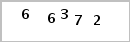
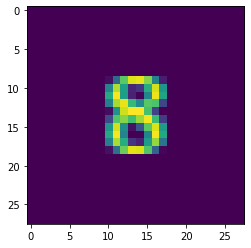
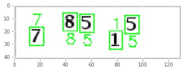
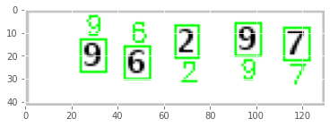

# simple numerical captcha solver

A very simple deep (not really) neural network implemented in tensorflow 2 that uses the [LeNet architecture][1] to solve easy numerical captchas, by default the scripts assume that you have 5 digits in the input image but it can be explicitly specified.

## directory structure

* `./data` - contains the processed dataset created after running `prepare.py` and the predicted images
* `./dataset` - it is a empty dir but it specifies the location where you need to place the downloaded dataset
* `./log` - contains the logs generated by the scripts
* `./model` - contains the `model.py` file where the model is defined, this directory also contains the saved model in `.h5` format
* `./prepare.py` - processes the dataset as:
    * extracts roi from individual images
    * saves the roi in `train` or `test` folder in the `./data` directory
* `./train.py` - trains the model
* `./predict.py` - get predictions
* `./utility.py` - contains useful functions for plotting and preprocessing
* `./api.py` - contains code for create prediction api using `fastapi`
* `./config.yml` - YAML file containing configurations for various model functions, fields in the config file are self-explanatory.

## images

* sample input for the model

    

* ROI extracted during preprocessing

    

* model outputs

    

    

[1]: https://direct.mit.edu/neco/article/1/4/541/5515/Backpropagation-Applied-to-Handwritten-Zip-Code